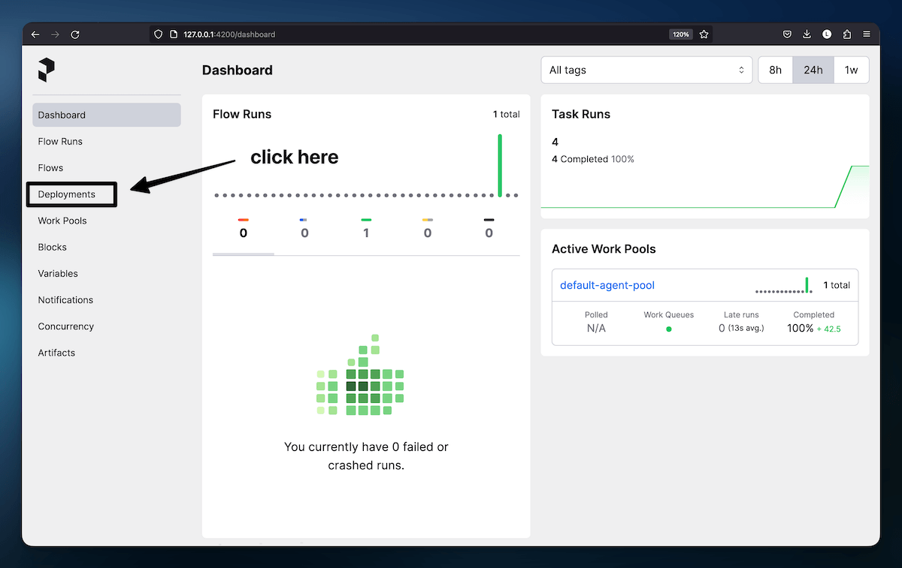
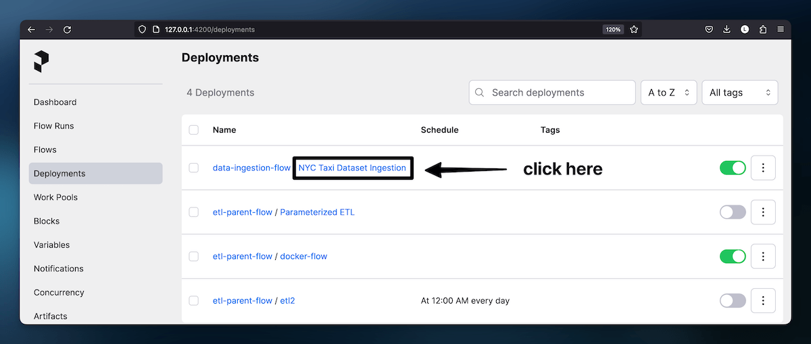
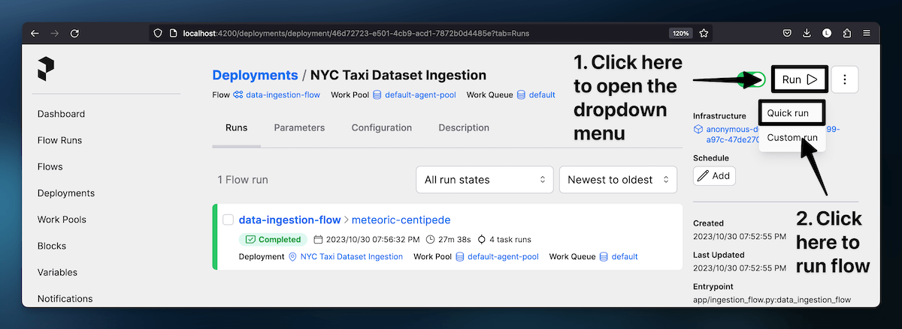

# NYC Taxi and Limousine Yellow Dataset Ingestion

## Table of Contents

- [Objective](#objective)
- [Dataset](#dataset)
- [Environment Setup](#environment-setup)
- [Running Locally with Prefect and Spark](#running-locally-with-prefect-and-spark)
- [Running Locally with Jupyter Notebook](#running-locally-jupyter-notebook)
- [Scalability & Performance](#scalability-and-performance)
- [Data Cleaning Notes](#data-cleaning-notes)

## Objective

- Ingest the dataset.
- Summarize the mean/median cost, prices, and passenger counts.
- Aggregate by payment type, year, month.
- Save the result.

## Dataset

[NYC Taxi & Limousine Commission - Yellow Taxi Trip Records](https://learn.microsoft.com/en-us/azure/open-datasets/dataset-taxi-yellow?tabs=azureml-opendatasets).

### Schema

| Name                 | Data type | NULLABLE |
| -------------------- | --------- | -------- |
| vendorID             | string    | True     |
| tpepPickupDateTime   | timestamp | True     |
| tpepDropoffDateTime  | timestamp | True     |
| passengerCount       | integer   | True     |
| tripDistance         | double    | True     |
| puLocationId         | string    | True     |
| doLocationId         | string    | True     |
| startLon             | double    | True     |
| startLat             | double    | True     |
| endLon               | double    | True     |
| endLat               | double    | True     |
| rateCodeId           | integer   | True     |
| storeAndFwdFlag      | string    | True     |
| paymentType          | string    | True     |
| fareAmount           | double    | True     |
| extra                | double    | True     |
| mtaTax               | double    | True     |
| improvementSurcharge | string    | True     |
| tipAmount            | double    | True     |
| tollsAmount          | double    | True     |
| totalAmount          | double    | True     |
| puYear               | integer   | True     |
| puMonth              | integer   | True     |

## Environment Setup

You will need `conda` to activate the environment. The recommended way to do
this is by installing [miniforge](https://github.com/conda-forge/miniforge).
I'll be listing commands for Mac but the link should have guides on installing
it for other operating systems.

```plain
brew install miniforge
conda init
```

Then, close your terminal and open a new terminal session.

Once, `conda` is installed, run the following commands in your terminal from the
root of this repository to create the environment used for this repository:

```plain
conda env create
conda activate nyc_taxi_ride_alvee
```

Note that you may have to open multiple terminal tabs or windows and activate
the environment in each of them since there will be multiple servers started.

In addition to `conda`, I have also installed `Spark 3.5.0` on my host machine.
You won't be able to create a standalone local cluster without installing it.
You can [install spark from here](https://spark.apache.org/downloads.html).

## Running Locally with Prefect and Spark

### Local Spark Cluster

The `master` is set to `local[*]` to simplify local execution.

You can run the following bash script to create a local Spark cluster for faster
processing. Make sure to update the variables if you're using a different OS or
package manager.

You'll have to decide the number of workers to create depending on your machine
by modifying the `start-spark-local-cluster.sh` script and the Spark config in
the `ingestion_flow.py` file.

To start the cluster, run the following script:

```bash
./start-spark-local-cluster.sh
```

To stop the cluster, run the following script:

```bash
./stop-spark-local-cluster.sh
```

### Prefect

#### Start Prefect Server

```
prefect server start
```

#### Create a Prefect Deployment

```bash
prefect deployment build app/ingestion_flow.py:data_ingestion_flow -n "NYC Taxi Dataset Ingestion"
```

#### Apply the Flow

```bash
prefect deployment apply data_ingestion_flow-deployment.yaml
```

#### Start a Prefect Agent

```bash
prefect agent start --work-queue 'default'
```

#### Run the Flow

- Go to [http://localhost:4200](http://127.0.0.1:4200) to open the Prefect
  Dashboard.
  <div style="margin-top: 10px; margin-bottom: 20px"></div>
- Click on "Deployment".
  <div style="margin-top: 10px; margin-bottom: 20px"></div>
- Click on "Run" and then on "Quick Run" to trigger the flow.
  <div style="margin-top: 10px;"></div>

## Running Locally with Jupyter Notebook

After activating the environment with `conda`, open the `exploration.ipynb` file
and click on "Run All" to populate the `data/result_exploration` folder with the
output data.

It will also read the local files in the same notebook.

## Scalability & Performance

- Prefect will allow us to easily switch to a cloud service with high
  scalability.

- Spark can be run on an online cluster such as DataProc for better performance.

- If I were to use cloud services, I would ingest the data to a data warehouse
  like BigQuery, set up dbt to transform the table, and then perform queries on
  the result table.

## Data Cleaning Notes

- I have mainly focused on the columns mentioned in the objective due to time
  constraints.

- There are various other cleaning steps that would be ideal for this dataset
  such as analysing the 6282 unique values for `paymentType`, validating
  location data,
